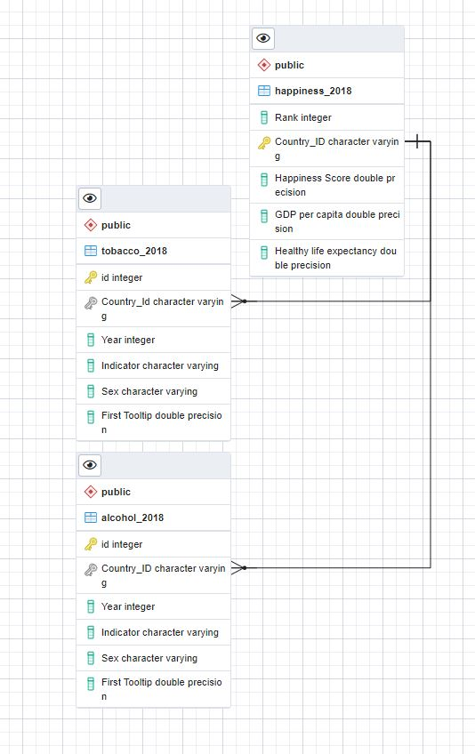

# Project 2 Group 5 : ETL Project

## World Health & Happiness Reports

### Members 
- Rebecca Kwon
- Mary Olaitan
- Neil Tipton
- Daniel Garza

## Technical Report:

### Extract:
Our data sources were from kaggle.com and consisted of the World Happiness Report, Alcohol & Substance Abuse report, and Tobacco Use for Ages 15+ report. Each data file is extracted as a csv file using pandas as pd.read_csv. The Alcohol & Substance Abuse report and Tobacco Use for Ages 15+ report were both from the World Health Statistics repository. They both contained data from 2000, 2005, 2010, 2015, and 2018. The Tobacco Use report contained 4,023 rows of data. The Alcohol & Substance abuse report contained 2,787 rows of data. The World Happiness Report repository contained datasets ranging from 2015 through 2019 and contained 156 rows of data. Between the three datasets, we chose to use data from 2018 as it was the most recent set of data and contained overlap. 

### Transform:
Each of the csv files were loaded individually into jupyter notebooks for transformation. For the Happiness Report, we used pandas to load the csv as a dataframe. Using the dataframe, we selected and renamed the columns for rank, country or region, happiness score, GDP per capita, and healthy life expectancy. The country column was renamed to 'Country_ID' to ensure consistency within the relational database. After dropping any null data, the dataframe was exported as a csv with the index defined as 'False' to ensure there was no predefined index. Similarly, the Alcohol & Substance abuse and Tobacco Use for Ages 15+ were loaded into individual jupyter notebooks. After the csv files were loaded in as dataframes, the column names were renamed to 'Country_ID', 'Indicator', 'Year,'Sex', and 'FirstTooltip'. The two world health statistics dataframes were filtered to only show results from 2018 to match the Happiness Report dataset. Both dataframes were exported as "cleaned" csv files with the index also defined as 'False' to ensure there were no duplicative indices.      

### Load: 
Before loading, blank tables were created within a postgres database ensuring column names matched the datasets to be loaded. For data loading, we first created a connection to the local created database in postgres using create_engine. Using pandas pd.read_csv, we loaded in the cleaned transformed datasets as dataframes.  Next, we used to_sql to load the csv converted dataframes into the connected database. We were then able to confirm the load into the postgres database by querying the tables. 

### ERD: 
Below is the ERD for the loaded databse showing the relations between the primary/foreign keys. 

### Data Sources:
- World Happiness Report "2018_happiness.csv" https://www.kaggle.com/unsdsn/world-happiness
- Alcohol & Substance Abuse "alcoholSubstanceAbuse.csv" https://www.kaggle.com/utkarshxy/who-worldhealth-statistics-2020-complete
- Tobacco Use for Ages 15+ "tobaccoAge15.csv" https://www.kaggle.com/utkarshxy/who-worldhealth-statistics-2020-complete
